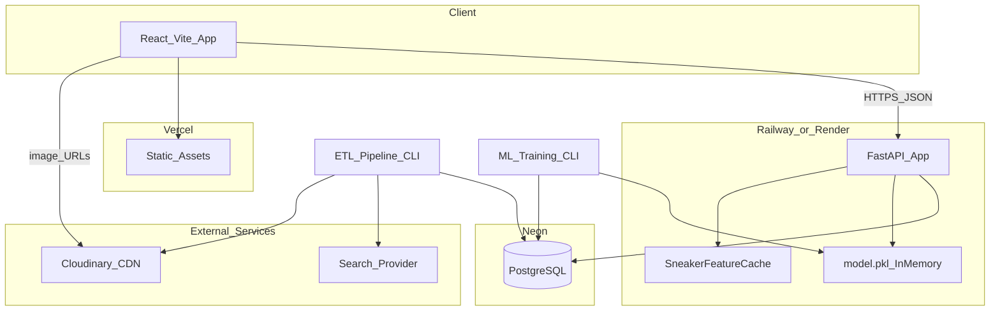
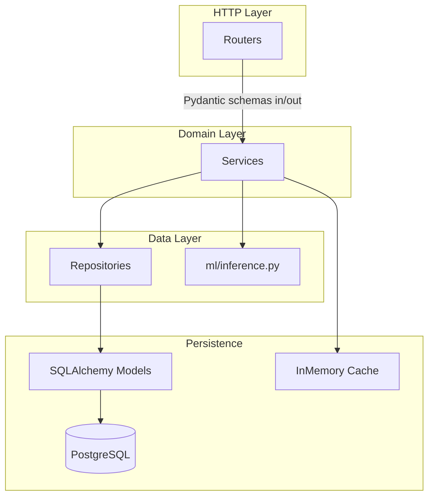
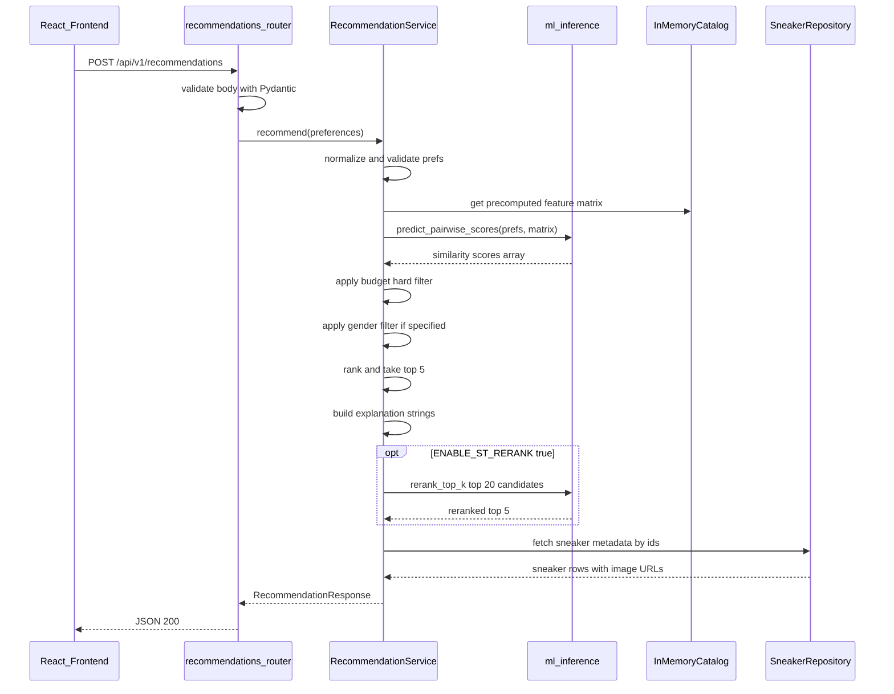
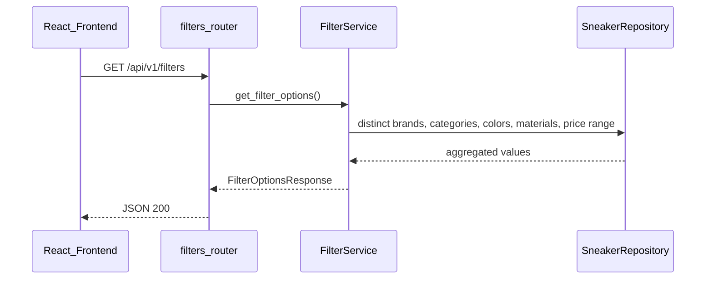
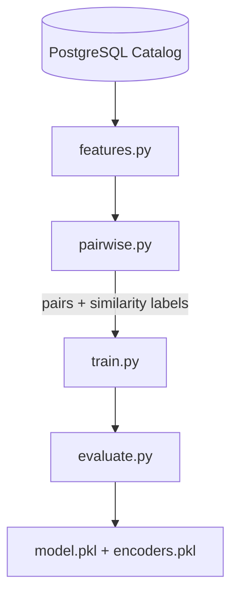
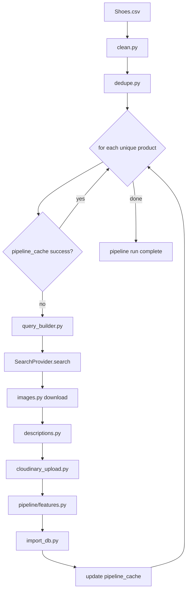
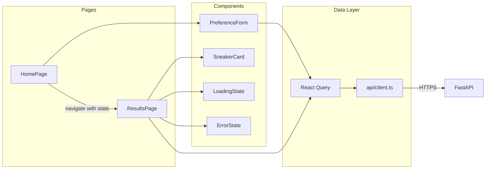
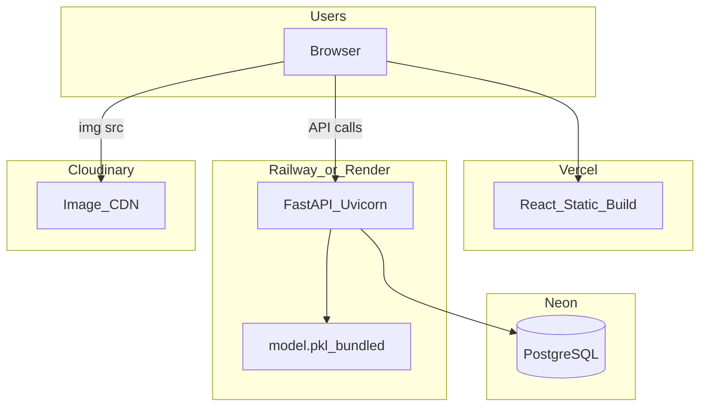

# Sneaker Recommendation System — Architecture

This document describes how the system is put together — components, folders, data flows, and deployment. Read [PROJECT_SPEC.md](./PROJECT_SPEC.md) for requirements and [DATABASE_SCHEMA.md](./DATABASE_SCHEMA.md) for table details.

---

## High Level Architecture

The app has four main parts: a React frontend, a FastAPI backend, a Neon PostgreSQL database, and external services (Cloudinary + search API). ML training and the data pipeline run offline as CLI scripts — they are not part of the live API request path.



### Component Responsibilities

| Component | Role |
|-----------|------|
| React frontend | Preference form, results display, API calls via React Query |
| FastAPI backend | REST API, recommendation logic, serves filter options |
| Neon PostgreSQL | Catalog storage, pipeline cache, optional analytics logs |
| Cloudinary | Image hosting — URLs stored in DB, images served from CDN |
| Search provider (SerpAPI default) | Product/image discovery during enrichment pipeline |
| ML training CLI | Offline — builds pairwise dataset, trains RF, saves `model.pkl` |
| ETL pipeline CLI | Offline — cleans CSV, enriches, imports to DB |

---

## Folder Structure

```
sneaker-recommendation-system/
├── PROJECT_SPEC.md
├── ARCHITECTURE.md
├── DATABASE_SCHEMA.md
├── API_SPEC.md
├── TASKS.md
├── AI_CONTEXT.md
├── guides/                              # user-facing guides only
│   ├── local-setup.md
│   ├── deployment.md
│   ├── ml-training.md
│   └── data-pipeline.md
├── backend/
│   ├── app/
│   │   ├── main.py                      # FastAPI app + lifespan (load model)
│   │   ├── config.py                    # pydantic-settings from env
│   │   ├── dependencies.py              # DI: db session, services
│   │   ├── routers/                     # thin HTTP layer — no business logic
│   │   │   ├── health.py
│   │   │   ├── filters.py
│   │   │   ├── recommendations.py
│   │   │   └── sneakers.py
│   │   ├── services/                    # business logic lives here
│   │   │   ├── recommendation_service.py
│   │   │   ├── filter_service.py
│   │   │   └── sneaker_service.py
│   │   ├── repositories/                # DB access only
│   │   │   ├── sneaker_repository.py
│   │   │   └── pipeline_repository.py
│   │   ├── models/                      # SQLAlchemy ORM models
│   │   │   ├── brand.py
│   │   │   ├── category.py
│   │   │   ├── sneaker.py
│   │   │   ├── pipeline_cache.py
│   │   │   └── user.py
│   │   ├── schemas/                     # Pydantic request/response DTOs
│   │   │   ├── recommendation.py
│   │   │   ├── filter.py
│   │   │   └── sneaker.py
│   │   └── utils/
│   │       ├── explanation.py           # build human reason strings
│   │       └── timing.py                # latency helper
│   ├── ml/
│   │   ├── README.md
│   │   ├── config.py
│   │   ├── features.py                  # feature engineering
│   │   ├── pairwise.py                  # pairwise similarity dataset builder
│   │   ├── train.py
│   │   ├── evaluate.py
│   │   ├── inference.py                 # score user prefs vs catalog
│   │   ├── rerank.py                    # optional Sentence Transformer rerank
│   │   └── artifacts/
│   │       ├── model.pkl
│   │       └── encoders.pkl             # label encoders saved with model
│   ├── pipeline/
│   │   ├── README.md
│   │   ├── run.py                       # orchestrator CLI entry point
│   │   ├── clean.py
│   │   ├── dedupe.py
│   │   ├── cache.py                     # read/write pipeline_cache
│   │   ├── search/
│   │   │   ├── base.py                  # SearchProvider ABC
│   │   │   ├── serpapi_provider.py      # default implementation
│   │   │   └── query_builder.py         # multi-attribute query strings
│   │   ├── images.py
│   │   ├── descriptions.py
│   │   ├── cloudinary_upload.py
│   │   ├── features.py
│   │   └── import_db.py
│   ├── alembic/
│   │   ├── env.py
│   │   └── versions/
│   ├── tests/
│   │   ├── test_api/
│   │   ├── test_ml/
│   │   └── test_pipeline/
│   ├── data/
│   │   └── Shoes.csv                    # Kaggle dataset (~1006 rows)
│   ├── requirements.txt
│   └── .env.example
├── frontend/
│   ├── src/
│   │   ├── main.tsx
│   │   ├── App.tsx
│   │   ├── router/
│   │   │   └── index.tsx
│   │   ├── api/
│   │   │   └── client.ts                # fetch wrapper + base URL
│   │   ├── hooks/
│   │   │   ├── useFilters.ts
│   │   │   └── useRecommendations.ts
│   │   ├── pages/
│   │   │   ├── HomePage.tsx
│   │   │   └── ResultsPage.tsx
│   │   ├── components/
│   │   │   ├── layout/
│   │   │   │   ├── Header.tsx
│   │   │   │   └── PageLayout.tsx
│   │   │   ├── forms/
│   │   │   │   └── PreferenceForm.tsx
│   │   │   ├── cards/
│   │   │   │   └── SneakerCard.tsx
│   │   │   └── ui/
│   │   │       ├── LoadingState.tsx
│   │   │       └── ErrorState.tsx
│   │   └── types/
│   │       ├── recommendation.ts
│   │       └── sneaker.ts
│   ├── index.html
│   ├── package.json
│   ├── vite.config.ts
│   └── .env.example
└── .cursor/
    └── rules/                           # project coding rules
```

**Note:** The existing CSV at `Backend/Data/Shoes.csv` moves to `backend/data/Shoes.csv` during Phase 1 implementation (Task 7).

---

## Layered Architecture

Every backend request follows the same path. Routers stay thin. Services own the logic. Repositories talk to the database.



### Layer Rules

| Layer | Allowed | Not Allowed |
|-------|---------|-------------|
| **Routers** | Parse HTTP, validate with Pydantic, call service, return response | Business logic, direct DB queries, ML calls |
| **Services** | Orchestration, recommendation scoring, explanation building | Raw SQL, HTTP concerns |
| **Repositories** | CRUD, filtered queries, pagination | Business rules, scoring logic |
| **Models (ORM)** | Table definitions, relationships | Methods with business logic |
| **Schemas (Pydantic)** | Input validation, response serialization | Database access |
| **ML module** | Training (offline), inference (called by service) | HTTP or DB access directly |

### Dependency Injection

FastAPI `dependencies.py` wires everything:

```python
# pattern — not actual implementation code
get_db()           → yields SQLAlchemy session
get_sneaker_repo() → SneakerRepository(session)
get_recommendation_service() → RecommendationService(repo, model_cache)
```

Services receive repositories and caches via constructor — easy to test with mocks.

---

## API Flow

### Recommendation Request (Main Path)



### Filter Options Request



Filter options can be cached in memory at startup (refreshed when catalog reloads) since they change only after a pipeline import.

---

## Recommendation Flow (ML Detail)

The ML pipeline is content-based with pairwise similarity. No collaborative filtering — we don't have user purchase history.

### Training (Offline)



1. **Feature engineering** — encode brand, category, gender as categoricals; tokenize color/material strings; normalize price
2. **Pairwise dataset** — for each pair of sneakers (A, B), compute a similarity label from attribute overlap (brand match, category match, color Jaccard, price proximity, etc.)
3. **Pairwise features** — for each pair, build a feature row: match flags, absolute price diff, color overlap score, etc.
4. **Train** — RandomForestRegressor learns to predict similarity score from pairwise features
5. **Evaluate** — holdout split, report MAE/RMSE, proxy NDCG@5
6. **Save** — Joblib dumps model + encoders to `ml/artifacts/`

### Inference (Online, at Request Time)

1. **Startup load** — `model.pkl`, encoders, and a precomputed feature matrix for all active sneakers loaded into memory via FastAPI lifespan
2. **User prefs → query profile** — map user selections into the same feature space as catalog items (partial profile — unset fields are neutral)
3. **Pairwise scoring** — for each catalog sneaker, build pairwise feature row (user profile × sneaker) → RF predicts similarity score
4. **Hard filters** — drop sneakers above `budget_max`; drop wrong gender when gender is specified
5. **Rank** — sort by score descending, take top 5 (or top 20 if rerank enabled)
6. **Explain** — inspect top contributing feature matches, generate reason strings
7. **Optional rerank** — if `ENABLE_ST_RERANK=true`, embed text summaries of query + top-20 candidates with Sentence Transformers, blend: `final = 0.85 * ml_score + 0.15 * st_score`

### Why Not FAISS

The catalog has ~850–1,000 unique sneakers after deduplication. Scoring all of them with a vectorized numpy loop takes under 10ms. FAISS adds complexity without benefit at this scale.

### Performance Budget (Target <150ms)

| Step | Budget |
|------|--------|
| Request validation | ~1ms |
| Pairwise feature build + RF predict (~1k items) | ~10–30ms |
| Budget/gender filter + sort | ~1ms |
| Optional ST rerank (top 20) | ~50–80ms |
| DB fetch metadata (5 ids) | ~5–15ms |
| Response serialization | ~1ms |
| **Total (no rerank)** | **~20–50ms** |
| **Total (with rerank)** | **~80–120ms** |

---

## Data Pipeline Flow

The enrichment pipeline is a CLI script run manually or in CI — not triggered by user requests.



### Dedup Rule

One product row per unique combination of:

`(brand, model, type, gender, color, material)`

The `Size` column from the CSV is dropped — same shoe in different sizes is the same product.

### Search Query Builder

Never search with just the model name. Always combine multiple attributes:

```
{Brand} {Model} {Color} {Gender} {Category} {Material}
```

Example: `Nike Air Max 90 White Men Running Mesh`

### Cache Key

SHA256 hash of normalized lowercase tuple:

`(brand, model, type, gender, color, material)`

Stored in `pipeline_cache.product_key`. On rerun, products with `status=success` and `stage=imported` are skipped.

### Search Provider Interface

```python
# conceptual — see pipeline/search/base.py
class SearchProvider(ABC):
    def search(self, query: str) -> SearchResult:
        """Returns product URL, image URL, and raw metadata."""
        ...
```

Default: `SerpapiProvider`. Swap by env var `SEARCH_PROVIDER=serpapi|duckduckgo|manual`.

---

## Frontend Architecture



### Routing

| Route | Page | Purpose |
|-------|------|---------|
| `/` | HomePage | Preference form |
| `/results` | ResultsPage | Top 5 recommendations |

Preferences passed to ResultsPage via React Router location state (or query params as fallback).

### State Management

React Query handles all server state:

- `useFilters()` — caches filter options, stale time 5 minutes
- `useRecommendations()` — mutation for POST, caches last result

No Redux or global state library needed.

---

## Deployment Architecture



### Environment Variables

| Service | Variable | Purpose |
|---------|----------|---------|
| Frontend | `VITE_API_BASE_URL` | Backend API URL |
| Backend | `DATABASE_URL` | Neon connection string |
| Backend | `CLOUDINARY_CLOUD_NAME` | Cloudinary account |
| Backend | `CLOUDINARY_API_KEY` | Upload auth |
| Backend | `CLOUDINARY_API_SECRET` | Upload auth |
| Backend | `SERPAPI_KEY` | Search during pipeline |
| Backend | `ENABLE_ST_RERANK` | `false` by default |
| Backend | `CORS_ORIGINS` | Comma-separated allowed origins |
| Backend | `MODEL_PATH` | Path to `model.pkl` (default: `ml/artifacts/model.pkl`) |

### Startup Command (Railway/Render)

```
uvicorn app.main:app --host 0.0.0.0 --port $PORT
```

No Docker in MVP. Railway/Render install from `requirements.txt` directly.

### CI/CD (Suggested)

| Trigger | Action |
|---------|--------|
| Push to `main` | Vercel auto-deploys frontend |
| Push to `main` | Railway auto-deploys backend |
| Manual | Run pipeline CLI to refresh catalog |
| Manual | Run `ml/train.py` after catalog changes, commit new `model.pkl` |

---

## Error Handling Strategy

| Layer | Approach |
|-------|----------|
| Routers | Catch service exceptions, map to HTTP status codes |
| Services | Raise domain exceptions (`ModelNotLoadedError`, `EmptyPreferencesError`) |
| Repositories | Let SQLAlchemy errors bubble up — service catches |
| Frontend | React Query `onError`, show `ErrorState` with retry button |
| Pipeline | Log errors to `pipeline_cache.last_error`, continue to next product |

Global FastAPI exception handler returns consistent JSON error shape:

```json
{
  "detail": "Model not loaded. Run ml/train.py first.",
  "error_code": "MODEL_NOT_LOADED"
}
```

---

## Testing Strategy

| Type | Location | What |
|------|----------|------|
| Unit | `tests/test_ml/` | Feature engineering, pairwise builder |
| Unit | `tests/test_pipeline/` | Clean, dedupe, query builder |
| Integration | `tests/test_api/` | FastAPI TestClient, mock model |
| Performance | `scripts/check_latency.py` | Assert p95 < 150ms locally |
| E2E | Manual smoke checklist | Full user flow in browser |

---

## Related Documents

- [PROJECT_SPEC.md](./PROJECT_SPEC.md)
- [DATABASE_SCHEMA.md](./DATABASE_SCHEMA.md)
- [API_SPEC.md](./API_SPEC.md)
- [TASKS.md](./TASKS.md)
- [AI_CONTEXT.md](./AI_CONTEXT.md)
