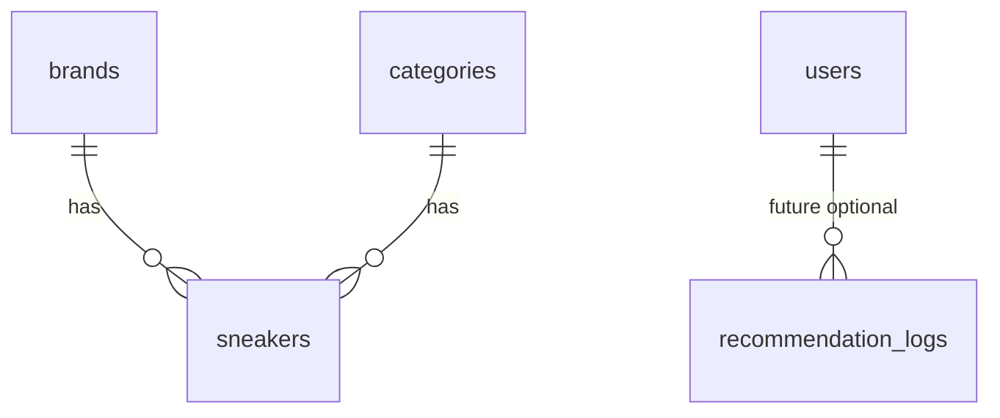
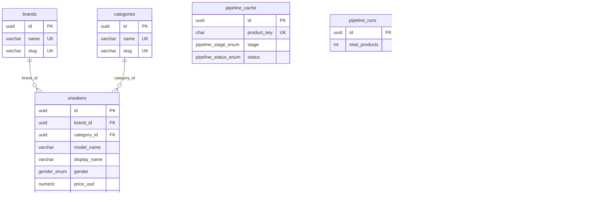

# Sneaker Recommendation System — Database Schema

PostgreSQL on Neon. Normalized schema with UUID primary keys. Images stored as URLs only — never binary blobs in the database.

This document describes the design. No SQL migrations yet — those come during implementation with Alembic.

---

## Overview

The database serves three purposes:

1. **Catalog** — sneakers, brands, categories for recommendations and browse
2. **Pipeline** — cache and audit tables so the enrichment CLI can resume
3. **Future** — user accounts and recommendation analytics (schema ready, not used in MVP)



---

## Tables

### `brands`

Lookup table for sneaker brands. Populated during pipeline import.

| Column | Type | Nullable | Default | Notes |
|--------|------|----------|---------|-------|
| id | UUID | NO | gen_random_uuid() | Primary key |
| name | VARCHAR(100) | NO | — | Display name, e.g. "Nike" |
| slug | VARCHAR(100) | NO | — | URL-safe, e.g. "nike" |
| created_at | TIMESTAMPTZ | NO | now() | |

**Unique constraints:** `name`, `slug`

**Example rows:**

| name | slug |
|------|------|
| Nike | nike |
| Adidas | adidas |
| New Balance | new-balance |

---

### `categories`

Maps from the CSV `Type` column — Running, Casual, Basketball, Skate, etc.

| Column | Type | Nullable | Default | Notes |
|--------|------|----------|---------|-------|
| id | UUID | NO | gen_random_uuid() | Primary key |
| name | VARCHAR(50) | NO | — | e.g. "Running" |
| slug | VARCHAR(50) | NO | — | e.g. "running" |
| created_at | TIMESTAMPTZ | NO | now() | |

**Unique constraints:** `name`, `slug`

---

### `sneakers`

Core catalog table. One row per unique product after deduplication.

| Column | Type | Nullable | Default | Notes |
|--------|------|----------|---------|-------|
| id | UUID | NO | gen_random_uuid() | Primary key |
| brand_id | UUID | NO | — | FK → brands.id |
| category_id | UUID | NO | — | FK → categories.id |
| model_name | VARCHAR(200) | NO | — | From CSV `Model` |
| display_name | VARCHAR(300) | NO | — | "{Brand} {Model}" for UI |
| gender | gender_enum | NO | — | See enum below |
| color | VARCHAR(100) | NO | — | Composite colors OK: "Red/Black" |
| material | VARCHAR(150) | NO | — | Composite OK: "Leather/Synthetic" |
| price_usd | NUMERIC(10,2) | NO | — | Parsed from "$170.00" |
| description | TEXT | YES | NULL | Generated by pipeline |
| image_url | VARCHAR(500) | YES | NULL | Cloudinary URL — required after import |
| product_url | VARCHAR(500) | YES | NULL | Retail link from search |
| search_query_used | VARCHAR(500) | YES | NULL | Audit: query sent to search API |
| ml_features | JSONB | YES | NULL | Precomputed extras for ML sync |
| is_active | BOOLEAN | NO | true | Soft hide bad/incomplete rows |
| created_at | TIMESTAMPTZ | NO | now() | |
| updated_at | TIMESTAMPTZ | NO | now() | Auto-updated on change |

#### `gender_enum`

| Value | CSV Source |
|-------|------------|
| men | "Men" |
| women | "Women" |
| unisex | "Unisex" or ambiguous values |

#### Dedup Rule

One row per unique combination:

```
(brand_id, model_name, category_id, gender, color, material)
```

The CSV `Size` column is ignored — same shoe in US 9 and US 10 collapses to one row. Keep the first price encountered (they're usually identical).

#### `ml_features` JSONB Example

```json
{
  "color_tokens": ["white", "black"],
  "material_tokens": ["leather", "mesh"],
  "price_bucket": "mid",
  "brand_tier": "premium"
}
```

---

### `pipeline_cache`

Tracks enrichment progress per product so the pipeline can skip completed work on rerun.

| Column | Type | Nullable | Default | Notes |
|--------|------|----------|---------|-------|
| id | UUID | NO | gen_random_uuid() | Primary key |
| product_key | CHAR(64) | NO | — | SHA256 of normalized product tuple |
| brand_name | VARCHAR(100) | NO | — | Denormalized for debugging |
| model_name | VARCHAR(200) | NO | — | Denormalized for debugging |
| stage | pipeline_stage_enum | NO | — | Last completed stage |
| status | pipeline_status_enum | NO | pending | Current status |
| last_error | TEXT | YES | NULL | Error message if failed |
| metadata | JSONB | YES | NULL | Search hits, Cloudinary public_id, etc. |
| created_at | TIMESTAMPTZ | NO | now() | |
| updated_at | TIMESTAMPTZ | NO | now() | |

#### `pipeline_stage_enum`

| Value | Meaning |
|-------|---------|
| cleaned | Passed clean.py |
| searched | Search API returned results |
| imaged | Image downloaded locally |
| described | Description generated |
| uploaded | Image uploaded to Cloudinary |
| imported | Row inserted/updated in sneakers table |

#### `pipeline_status_enum`

| Value | Meaning |
|-------|---------|
| pending | Not started or in progress |
| success | Stage completed OK |
| failed | Error — see last_error |
| skipped | Intentionally skipped (e.g. duplicate) |

#### `product_key` Generation

```
SHA256(lowercase("{brand}|{model}|{type}|{gender}|{color}|{material}"))
```

#### `metadata` JSONB Example

```json
{
  "search_query": "Nike Air Max 90 White Men Running Mesh",
  "search_result_url": "https://www.nike.com/...",
  "cloudinary_public_id": "sneakers/nike-air-max-90-white",
  "local_image_path": "/tmp/nike-air-max-90.jpg"
}
```

---

### `pipeline_runs`

Optional audit log for full pipeline executions.

| Column | Type | Nullable | Default | Notes |
|--------|------|----------|---------|-------|
| id | UUID | NO | gen_random_uuid() | Primary key |
| started_at | TIMESTAMPTZ | NO | now() | |
| finished_at | TIMESTAMPTZ | YES | NULL | NULL while running |
| total_products | INT | NO | 0 | Products processed this run |
| success_count | INT | NO | 0 | |
| failed_count | INT | NO | 0 | |
| skipped_count | INT | NO | 0 | Already cached |
| notes | TEXT | YES | NULL | Free text, e.g. "first full import" |

---

### `users` (Future — Not MVP)

Reserved for when auth gets implemented. No routes or logic in MVP.

| Column | Type | Nullable | Default | Notes |
|--------|------|----------|---------|-------|
| id | UUID | NO | gen_random_uuid() | Primary key |
| email | VARCHAR(255) | NO | — | Login email |
| hashed_password | VARCHAR(255) | NO | — | bcrypt hash |
| is_active | BOOLEAN | NO | true | |
| created_at | TIMESTAMPTZ | NO | now() | |
| updated_at | TIMESTAMPTZ | NO | now() | |

**Unique constraints:** `email`

---

### `recommendation_logs` (Optional Analytics)

Lightweight logging for debugging and future analytics. Can be disabled in MVP if not needed.

| Column | Type | Nullable | Default | Notes |
|--------|------|----------|---------|-------|
| id | UUID | NO | gen_random_uuid() | Primary key |
| request_json | JSONB | NO | — | Preferences submitted |
| result_ids | UUID[] | YES | NULL | Top 5 sneaker IDs returned |
| latency_ms | INT | YES | NULL | Server-side timing |
| created_at | TIMESTAMPTZ | NO | now() | |

No FK to users in MVP — anonymous requests only.

---

## Relationships



### Foreign Key Rules

| FK | On Delete | On Update |
|----|-----------|-----------|
| sneakers.brand_id → brands.id | RESTRICT | CASCADE |
| sneakers.category_id → categories.id | RESTRICT | CASCADE |

Don't delete a brand or category if sneakers reference it. Update the parent UUID cascades to children.

---

## Indexes

### `brands`

| Index | Columns | Type | Purpose |
|-------|---------|------|---------|
| pk_brands | id | PRIMARY | |
| uq_brands_name | name | UNIQUE | Lookup by name |
| uq_brands_slug | slug | UNIQUE | URL routing later |

### `categories`

| Index | Columns | Type | Purpose |
|-------|---------|------|---------|
| pk_categories | id | PRIMARY | |
| uq_categories_name | name | UNIQUE | |
| uq_categories_slug | slug | UNIQUE | |

### `sneakers`

| Index | Columns | Type | Purpose |
|-------|---------|------|---------|
| pk_sneakers | id | PRIMARY | |
| idx_sneakers_brand_id | brand_id | BTREE | Filter by brand |
| idx_sneakers_category_id | category_id | BTREE | Filter by category |
| idx_sneakers_gender | gender | BTREE | Filter by gender |
| idx_sneakers_price_usd | price_usd | BTREE | Budget filter + range queries |
| idx_sneakers_is_active | is_active | PARTIAL (WHERE is_active = true) | Active catalog only |
| idx_sneakers_brand_cat_gender | brand_id, category_id, gender | COMPOSITE | Browse page filtered queries |
| uq_sneakers_dedup | brand_id, model_name, category_id, gender, color, material | UNIQUE | Enforce dedup rule |

### `pipeline_cache`

| Index | Columns | Type | Purpose |
|-------|---------|------|---------|
| pk_pipeline_cache | id | PRIMARY | |
| uq_pipeline_cache_product_key | product_key | UNIQUE | Fast cache lookup |
| idx_pipeline_cache_status | status | BTREE | Find failed products for retry |

### `recommendation_logs`

| Index | Columns | Type | Purpose |
|-------|---------|------|---------|
| pk_recommendation_logs | id | PRIMARY | |
| idx_recommendation_logs_created_at | created_at | BTREE | Time-range queries |

---

## Constraints

### Check Constraints

| Table | Constraint | Rule |
|-------|------------|------|
| sneakers | chk_price_positive | price_usd >= 0 |
| sneakers | chk_display_name_not_empty | length(display_name) > 0 |
| pipeline_runs | chk_counts_non_negative | total_products, success_count, failed_count, skipped_count >= 0 |

### Not Null Rules (After Pipeline Import)

During partial pipeline runs, `image_url` and `description` may be NULL temporarily. Before marking a sneaker as `is_active = true`, both must be populated.

Application-level validation enforces this — not a DB constraint, so partial imports don't break.

### Enum Constraints

Postgres native ENUM types (or SQLAlchemy Enum with check constraints):

- `gender_enum`: men, women, unisex
- `pipeline_stage_enum`: cleaned, searched, imaged, described, uploaded, imported
- `pipeline_status_enum`: pending, success, failed, skipped

---

## Common Queries

These inform index choices. No SQL yet — just describing intent.

### Filter Options (GET /api/v1/filters)

- Distinct brand names (join brands)
- Distinct category names (join categories)
- Distinct genders, colors, materials from sneakers WHERE is_active
- MIN(price_usd), MAX(price_usd) from active sneakers

**Optimization:** Materialized view `filter_options_mv` refreshed after pipeline import. Not needed for MVP at ~1k rows.

### Recommendation Metadata Fetch

- SELECT sneakers + brand name + category name WHERE id IN (5 uuids)

Single query with JOINs — indexed on PK.

### Browse Catalog (GET /api/v1/sneakers)

- Paginated SELECT with optional filters on brand_id, category_id, gender
- ORDER BY display_name
- Uses composite index on (brand_id, category_id, gender)

### Pipeline Cache Lookup

- SELECT FROM pipeline_cache WHERE product_key = ? AND status = 'success' AND stage = 'imported'

Uses unique index on product_key — O(1) lookup.

---

## Data Volume Estimates

| Table | Estimated Rows (MVP) | Growth |
|-------|---------------------|--------|
| brands | ~15 | Slow — new brands rare |
| categories | ~10 | Slow |
| sneakers | ~850–1,000 | After dedup from 1,006 CSV rows |
| pipeline_cache | ~850–1,000 | One per unique product |
| pipeline_runs | ~5–10 | One per pipeline execution |
| recommendation_logs | 0 (optional) | Grows with traffic |
| users | 0 | Future |

---

## Future Scalability

### Short Term (Up to ~10k sneakers)

Current schema works as-is. In-memory ML scoring still fast. No schema changes needed.

### Medium Term

| Need | Solution |
|------|----------|
| Slow filter queries | Materialized view `filter_options_mv`, refresh on pipeline import |
| Analytics volume | Partition `recommendation_logs` by month |
| Read-heavy traffic | Neon read replica for analytics queries |
| User accounts | Activate `users` table, add `saved_preferences` table with JSONB |
| Full-text browse search | Add `tsvector` column on `display_name`, GIN index |

### `saved_preferences` (Future Table)

| Column | Type | Notes |
|--------|------|-------|
| id | UUID PK | |
| user_id | UUID FK → users | |
| name | VARCHAR(100) | e.g. "My running shoes" |
| preferences | JSONB | Same shape as recommendation request |
| created_at | TIMESTAMPTZ | |

### Long Term (100k+ sneakers)

- Approximate nearest neighbor index (consider FAISS or pgvector) for ML scoring
- Catalog sharding by category or brand
- Separate read/write database connections
- CDN cache for filter options API response

None of this is needed for MVP.

---

## Migration Strategy

Alembic manages all schema changes:

1. **Initial migration** — creates all tables, enums, indexes
2. **Future migrations** — additive only where possible (new columns, new tables)
3. **Never** store image binary in PostgreSQL — if someone tries, reject in code review

Seed data comes from the enrichment pipeline (`import_db.py`), not from Alembic seed scripts.

---

## Related Documents

- [PROJECT_SPEC.md](./PROJECT_SPEC.md)
- [ARCHITECTURE.md](./ARCHITECTURE.md)
- [API_SPEC.md](./API_SPEC.md)
- [TASKS.md](./TASKS.md)
- [AI_CONTEXT.md](./AI_CONTEXT.md)
