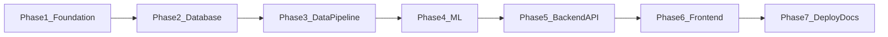

# Sneaker Recommendation System — Project Specification

## Project Overview

The Sneaker Recommendation System is a production-style web app that helps users find sneakers matching their preferences. A user picks things like brand, category, budget, gender, color, and material. The backend scores the full catalog with a trained ML model and returns the **top 5 most similar sneakers**.

Each recommendation includes the shoe image, name, brand, price, category, material, similarity score, product URL (when we have one), and a short explanation of why it was picked.

Speed matters. After the server warms up, the recommendation API should respond in **under 150ms**.

The dataset comes from Kaggle (~1,000 rows in `Shoes.csv`). Before the app goes live, a data pipeline cleans that CSV, searches for real product info, downloads images, uploads them to Cloudinary, generates descriptions, and imports everything into Neon PostgreSQL.

This is a beginner-friendly project. Code stays layered but simple — no unnecessary abstractions.

---

## Features

| Area | MVP | Later |
|------|-----|-------|
| Preference form + results UI | Yes | — |
| Fast ML recommendations (<150ms) | Yes | — |
| Explainable results | Yes | — |
| Kaggle data enrichment pipeline | Yes | — |
| Cloudinary images | Yes | — |
| Optional Sentence Transformer rerank | Flag only | Full implementation |
| User accounts / saved preferences | Schema only | Full implementation |

### MVP User Flow

1. User opens the app and sees a preference form.
2. User selects one or more filters (brand, category, budget, gender, color, material).
3. User submits the form.
4. Frontend calls the recommendation API.
5. Results page shows 5 sneaker cards with images, scores, and reasons.

### Out of Scope (MVP)

- User login and registration
- Shopping cart or checkout
- Real-time inventory sync with retailers
- Docker containers
- FAISS or embedding-only recommendations

---

## Functional Requirements

### FR-1 — User Preferences

The user can select any combination of:

- Brand
- Category (maps from CSV `Type` — Running, Casual, Basketball, etc.)
- Budget (maximum price in USD)
- Gender
- Color
- Material

All fields are optional, but **at least one** must be provided. The API rejects empty requests.

### FR-2 — Top 5 Recommendations

The system returns up to **5 ranked sneakers**, sorted by similarity score (highest first). If the catalog cannot fill 5 matches after filtering (e.g. very strict budget), return whatever is available and note the count in the response metadata.

### FR-3 — Result Display Fields

Each recommendation must include:

| Field | Required | Notes |
|-------|----------|-------|
| Shoe image | Yes | Cloudinary URL from DB |
| Shoe name | Yes | `display_name` (e.g. "Nike Air Max 90") |
| Brand | Yes | |
| Price | Yes | USD, numeric |
| Category | Yes | |
| Material | Yes | |
| Similarity score | Yes | 0.0–1.0, rounded to 2 decimals |
| Product URL | No | Nullable if search did not find one |
| Reasons | Yes | List of plain-English strings |

### FR-4 — Filter Options

A read-only endpoint returns distinct values from the database for populating dropdowns: brands, categories, genders, colors, materials, and min/max price range.

### FR-5 — Data Enrichment Pipeline

An offline CLI pipeline must:

1. Load the Kaggle CSV
2. Clean and normalize data (price parsing, gender normalization, trim whitespace)
3. Remove duplicates (collapse size variants — same shoe in US 9 and US 10 becomes one row)
4. Search for products using multi-attribute queries (never model name alone)
5. Download images from search results
6. Generate short descriptions
7. Upload images to Cloudinary
8. Store image URLs (not binary) in PostgreSQL
9. Generate extra ML features and save to JSONB column

Example search query: `Nike Air Max 90 White Men Running Mesh`

### FR-6 — Pipeline Caching

The pipeline tracks progress per product in a `pipeline_cache` table. Rerunning the pipeline skips products already marked as successfully imported. Failed products can be retried with a `--resume` flag.

### FR-7 — Machine Learning Model

The recommendation model must be **trained from scratch** on a pairwise similarity dataset:

```
Dataset → Cleaning → Feature Engineering → Pairwise Similarity Dataset
  → Model Training → Evaluation → model.pkl → FastAPI
```

- Primary model: **Random Forest Regressor** (XGBoost is an acceptable alternative)
- Save/load with **Joblib**
- Sentence Transformers may rerank the top ~20 ML candidates only — never replace the primary model
- Do not use FAISS (catalog is small enough for in-memory scoring)

### FR-8 — Recommendation Explanations

Every result must explain why it was selected. Examples:

- "Same brand: Nike"
- "Category match: Running"
- "Within your budget"
- "Similar color: White"
- "Matching material: Mesh"

---

## Non-Functional Requirements

### Performance

| Metric | Target |
|--------|--------|
| Recommendation API latency (p95, warm server) | < 150ms |
| Model + catalog load at startup | < 30s |
| Frontend first contentful paint | < 2s on broadband |

Achieved by preloading `model.pkl` and a sneaker feature matrix into memory at startup. No per-request model load. No FAISS — brute-force scoring over ~1k items is fast enough.

### Maintainability

- Layered architecture: Routers → Services → Repositories
- Business logic never lives in route handlers
- Database logic never lives in services directly (use repositories)
- Functions stay reasonably small
- Type hints everywhere (Python + TypeScript)

### Scalability (Current Scale)

The catalog is ~1,000 sneakers after deduplication. The design handles up to ~10k sneakers without architectural changes. Beyond that, consider approximate nearest neighbor search or catalog sharding.

### Security

- MVP has no authentication (public API)
- `users` table reserved in schema for future JWT auth
- Secrets via environment variables only (never committed)
- CORS restricted to known frontend origins in production

### Documentation

- Human-sounding prose — simple English, not corporate AI tone
- Module READMEs with examples
- User guides live in `guides/` only (never inside `backend/` or `frontend/`)
- Slight grammar mistakes in comments/docs are fine

### UI/UX

- Responsive layout (mobile + desktop)
- Loading states during API calls
- Error states with retry option
- Reusable React components — no copy-pasted UI blocks

---

## Technology Choices

### Frontend

| Tech | Purpose |
|------|---------|
| React | UI framework |
| Vite | Dev server and build tool |
| React Query | Server state, caching, loading/error handling |
| React Router | Page navigation (Home → Results) |
| TypeScript | Type safety |

Hosted on **Vercel**.

### Backend

| Tech | Purpose |
|------|---------|
| FastAPI | HTTP API |
| Pydantic | Request/response validation |
| SQLAlchemy | ORM |
| Alembic | Database migrations |
| Scikit-learn | Random Forest training and inference |
| Pandas | Data manipulation in pipeline and ML |
| Joblib | Model serialization |

Hosted on **Railway** or **Render**.

### Database

| Tech | Purpose |
|------|---------|
| Neon PostgreSQL | Managed Postgres |

Normalized schema. Images stored as URLs only — never binary in the database.

### Images

| Tech | Purpose |
|------|---------|
| Cloudinary | Image hosting and CDN |

Pipeline uploads during enrichment. Frontend loads images directly from Cloudinary URLs.

### Machine Learning

| Component | Choice | Why |
|-----------|--------|-----|
| Primary model | Random Forest Regressor | Simple, fast inference, works well with mixed categorical/numeric pairwise features, beginner-friendly |
| Alternative | XGBoost Regressor | Better accuracy possible; swap in `train.py` if needed |
| Optional rerank | Sentence Transformers | Semantic rerank of top-20 ML picks; disabled by default via `ENABLE_ST_RERANK=false` |
| Vector search | None (no FAISS) | ~1k items — numpy vectorized loop is <10ms |

### Data Enrichment Search

Pluggable provider interface with **SerpAPI** as the default implementation. Alternatives (DuckDuckGo scraper, manual CSV enrichment) can be plugged in without changing the pipeline orchestrator.

---

## Development Strategy

Build the project in **7 phases**. Each phase produces something testable on its own.



### Phase 1 — Foundation

Set up repo structure, planning docs, backend/frontend scaffolds, and env conventions. Relocate `Shoes.csv` to `backend/data/`.

### Phase 2 — Database

SQLAlchemy models, Alembic migrations, repositories, Pydantic schemas. Connect to Neon and verify migrations run clean.

### Phase 3 — Data Pipeline

Build the enrichment CLI: clean → dedupe → search → image → Cloudinary → import. Cache progress so reruns are cheap.

### Phase 4 — Machine Learning

Feature engineering, pairwise dataset, train Random Forest, evaluate, save `model.pkl`. Optional rerank stub behind env flag.

### Phase 5 — Backend API

FastAPI app with lifespan model loader, in-memory catalog cache, recommendation service with explanations, all endpoints wired up. Integration tests and a local perf check script.

### Phase 6 — Frontend

React preference form, results page, sneaker cards, loading/error states, React Query integration.

### Phase 7 — Deploy and Docs

Deploy frontend to Vercel, backend to Railway/Render, DB on Neon. Write guides for local setup, deployment, ML training, and the data pipeline. End-to-end smoke test.

---

## Success Criteria

The project is done when:

1. A user can submit preferences and see 5 ranked sneakers with images and reasons
2. The recommendation API responds in under 150ms on a warm server
3. The ML model is trained from scratch and loaded via Joblib
4. The enrichment pipeline can process the full CSV with resume support
5. All images are served from Cloudinary URLs stored in PostgreSQL
6. Code follows layered architecture with no business logic in routers
7. Guides exist in `guides/` for setup, deployment, ML, and pipeline

---

## Related Documents

- [ARCHITECTURE.md](./ARCHITECTURE.md) — system design, folder structure, flows
- [DATABASE_SCHEMA.md](./DATABASE_SCHEMA.md) — PostgreSQL table design
- [API_SPEC.md](./API_SPEC.md) — endpoint reference
- [TASKS.md](./TASKS.md) — implementation task breakdown
- [AI_CONTEXT.md](./AI_CONTEXT.md) — quick reference for AI assistants
