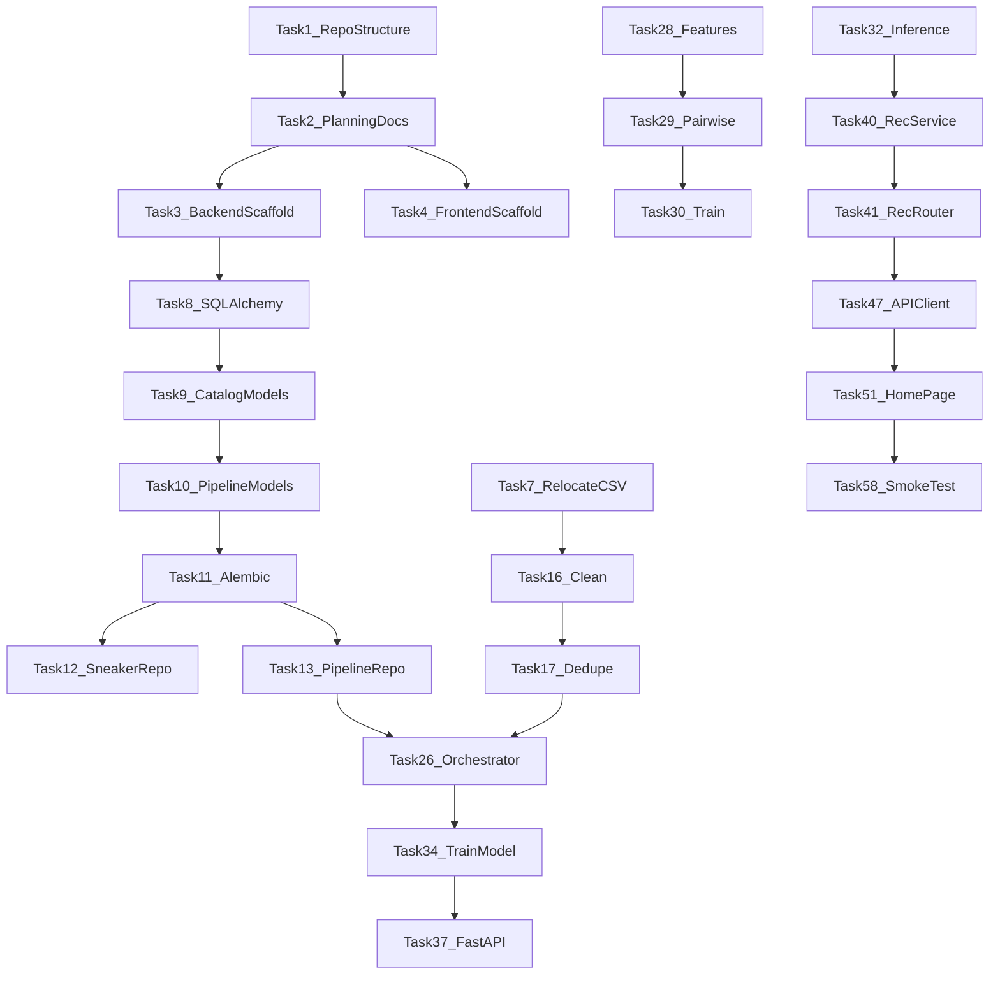

# Sneaker Recommendation System — Implementation Tasks

58 small tasks grouped into 7 phases. Each task is independently buildable — you should be able to finish one, verify it works, then move to the next.

Done criteria are explicit. Don't mark a task complete until every checkbox passes.

See [ARCHITECTURE.md](./ARCHITECTURE.md) for folder structure and [API_SPEC.md](./API_SPEC.md) for endpoint details.

---

## Phase 1 — Foundation

### Task 1 — Initialize Repo Structure

Create the top-level folder layout:

- `backend/` with `app/`, `ml/`, `pipeline/`, `alembic/`, `tests/`, `data/` subfolders
- `frontend/` with `src/` subfolders per ARCHITECTURE.md
- `guides/` (empty for now)

**Done when:**
- [ ] All folders from ARCHITECTURE.md exist
- [ ] Each major folder has a placeholder `.gitkeep` or README stub where noted
- [ ] Root `.gitignore` covers `__pycache__`, `.env`, `node_modules`, `venv`, `.DS_Store`

---

### Task 2 — Create Root Planning Docs

Write the six blueprint documents at repo root:

- `PROJECT_SPEC.md`
- `ARCHITECTURE.md`
- `DATABASE_SCHEMA.md`
- `API_SPEC.md`
- `TASKS.md`
- `AI_CONTEXT.md`

**Done when:**
- [ ] All six files exist with full content
- [ ] Mermaid diagrams render in ARCHITECTURE.md
- [ ] No application code created — docs only

---

### Task 3 — Backend Scaffold

Set up backend project basics:

- `backend/requirements.txt` with pinned versions: fastapi, uvicorn, sqlalchemy, alembic, pydantic, pydantic-settings, psycopg2-binary, pandas, scikit-learn, joblib, python-dotenv, httpx, cloudinary
- `backend/.env.example` with all env vars documented
- `backend/app/config.py` using pydantic-settings
- `backend/app/__init__.py`

**Done when:**
- [ ] `pip install -r requirements.txt` succeeds in a venv
- [ ] `config.py` loads settings from `.env` without errors
- [ ] `.env.example` lists every variable with a comment

---

### Task 4 — Frontend Scaffold

Initialize React + Vite + TypeScript:

```bash
npm create vite@latest frontend -- --template react-ts
```

Add dependencies: `@tanstack/react-query`, `react-router-dom`

**Done when:**
- [ ] `npm run dev` starts without errors
- [ ] Default Vite page loads in browser
- [ ] React Query and React Router installed in `package.json`

---

### Task 5 — Frontend Linting

Add ESLint and Prettier config for the frontend.

**Done when:**
- [ ] `npm run lint` passes on default files
- [ ] Prettier config exists and formats TSX files
- [ ] No lint errors on scaffold

---

### Task 6 — Local Setup Guide

Write `guides/local-setup.md` covering:

- Python venv setup
- Node.js version requirement
- How to copy `.env.example` → `.env`
- Neon database setup (create project, get connection string)
- Cloudinary account setup
- SerpAPI key setup

**Done when:**
- [ ] Guide exists in `guides/` (not inside backend/frontend)
- [ ] A new developer can follow it step by step
- [ ] All required env vars are listed

---

### Task 7 — Relocate Dataset

Move `Backend/Data/Shoes.csv` → `backend/data/Shoes.csv`.

**Done when:**
- [ ] CSV exists at `backend/data/Shoes.csv`
- [ ] File has ~1006 lines including header
- [ ] Old path removed or noted in git history

---

## Phase 2 — Database

### Task 8 — SQLAlchemy Base and Session

Create database connection layer:

- `backend/app/models/base.py` — declarative Base
- `backend/app/database.py` — engine, SessionLocal, `get_db()` generator

**Done when:**
- [ ] Engine connects using `DATABASE_URL` from config
- [ ] `get_db()` yields a session and closes it after use
- [ ] Connection test script runs without error against Neon

---

### Task 9 — ORM Models: Catalog

Create SQLAlchemy models:

- `backend/app/models/brand.py`
- `backend/app/models/category.py`
- `backend/app/models/sneaker.py`

Match [DATABASE_SCHEMA.md](./DATABASE_SCHEMA.md) column definitions. Include relationships.

**Done when:**
- [ ] All columns and types match schema doc
- [ ] FK relationships defined (sneakers → brands, categories)
- [ ] gender_enum defined
- [ ] Unique constraint on dedup columns

---

### Task 10 — ORM Models: Pipeline and Users

Create:

- `backend/app/models/pipeline_cache.py`
- `backend/app/models/pipeline_run.py`
- `backend/app/models/user.py` (stub for future auth)

**Done when:**
- [ ] pipeline_stage_enum and pipeline_status_enum defined
- [ ] user model exists but has no routes yet
- [ ] All models imported in `models/__init__.py`

---

### Task 11 — Alembic Migrations

Initialize Alembic and create first migration:

```bash
alembic init alembic
alembic revision --autogenerate -m "initial schema"
alembic upgrade head
```

**Done when:**
- [ ] `alembic upgrade head` runs clean against Neon
- [ ] All tables, enums, and indexes from DATABASE_SCHEMA.md exist in DB
- [ ] `alembic downgrade -1` and re-upgrade works

---

### Task 12 — SneakerRepository

Create `backend/app/repositories/sneaker_repository.py`:

- `get_by_id(id)` → sneaker with brand/category joined
- `get_by_ids(ids)` → list of sneakers
- `get_filter_options()` → distinct brands, categories, genders, colors, materials, price range
- `list_sneakers(filters, page, page_size)` → paginated results
- `count(filters)` → total for pagination

**Done when:**
- [ ] All methods implemented with SQLAlchemy queries
- [ ] No business logic in repository
- [ ] Manual test with empty DB returns empty lists (no crash)

---

### Task 13 — PipelineRepository

Create `backend/app/repositories/pipeline_repository.py`:

- `get_cache(product_key)` → cache row or None
- `upsert_cache(product_key, stage, status, metadata)` → update or insert
- `get_failed_products()` → list for retry
- `create_run()` / `finish_run()` → pipeline audit

**Done when:**
- [ ] Cache lookup by product_key works
- [ ] Upsert updates existing row instead of duplicating
- [ ] Pipeline run tracking works

---

### Task 14 — Pydantic Schemas

Create request/response schemas in `backend/app/schemas/`:

- `filter.py` — FilterOptionsResponse
- `sneaker.py` — SneakerSummary, SneakerDetail, PaginatedSneakers
- `recommendation.py` — RecommendationRequest, RecommendationResult, RecommendationResponse

Match [API_SPEC.md](./API_SPEC.md) field definitions exactly.

**Done when:**
- [ ] All schemas have type hints and Field descriptions
- [ ] RecommendationRequest validates "at least one field required"
- [ ] budget_max validation (> 0) works

---

### Task 15 — Database Connection Test

Write a small test script or pytest that:

- Connects to Neon
- Runs a simple query (`SELECT 1`)
- Verifies all tables exist

**Done when:**
- [ ] Test passes against Neon dev database
- [ ] Documented in `guides/local-setup.md` how to run it

---

## Phase 3 — Data Pipeline

### Task 16 — clean.py

Create `backend/pipeline/clean.py`:

- Load CSV with pandas
- Parse `$170.00` → `170.00` float
- Normalize gender ("Men" → "men", etc.)
- Strip whitespace from all string columns
- Return cleaned DataFrame

**Done when:**
- [ ] Price parsing handles `$170.00` and edge cases
- [ ] Gender normalized to men/women/unisex
- [ ] Script runs standalone: `python -m pipeline.clean`

---

### Task 17 — dedupe.py

Create `backend/pipeline/dedupe.py`:

- Collapse rows with same (brand, model, type, gender, color, material)
- Drop Size column
- Keep first price if duplicates disagree
- Return deduped DataFrame (~850–1000 rows)

**Done when:**
- [ ] Row count drops from ~1006 to ~850–1000
- [ ] No duplicate product keys after dedup
- [ ] Size column removed from output

---

### Task 18 — query_builder.py

Create `backend/pipeline/search/query_builder.py`:

- `build_query(brand, model, type, gender, color, material)` → search string
- Order: Brand, Model, Color, Gender, Category, Material
- Never return model name alone

**Done when:**
- [ ] Example: `("Nike", "Air Max 90", "Running", "Men", "White", "Mesh")` → `"Nike Air Max 90 White Men Running Mesh"`
- [ ] Handles missing optional fields gracefully
- [ ] Unit test with 3+ examples

---

### Task 19 — SearchProvider

Create:

- `backend/pipeline/search/base.py` — ABC with `search(query) → SearchResult`
- `backend/pipeline/search/serpapi_provider.py` — SerpAPI implementation

SearchResult dataclass: `product_url`, `image_url`, `title`, `raw_metadata`

**Done when:**
- [ ] ABC defined with clear interface
- [ ] SerpAPI provider returns at least one result for a test query
- [ ] Provider selected via `SEARCH_PROVIDER` env var
- [ ] Errors caught and returned as empty result (don't crash pipeline)

---

### Task 20 — images.py

Create `backend/pipeline/images.py`:

- Download image from URL to temp file
- Validate it's actually an image (content-type or PIL check)
- Return local file path

**Done when:**
- [ ] Downloads a real image from a test URL
- [ ] Rejects non-image responses
- [ ] Cleans up temp files after upload (or documents cleanup in orchestrator)

---

### Task 21 — descriptions.py

Create `backend/pipeline/descriptions.py`:

- Template-based description generator (no LLM needed for MVP)
- Input: brand, model, category, gender, color, material, price
- Output: 2–3 sentence product description

Example template: `"{Brand} {Model} is a {category} shoe for {gender}. Features {color} colorway with {material} upper. Priced at ${price}."`

**Done when:**
- [ ] Generates readable descriptions for 5 test products
- [ ] No empty descriptions returned
- [ ] Reads naturally (not robotic)

---

### Task 22 — cloudinary_upload.py

Create `backend/pipeline/cloudinary_upload.py`:

- Upload local image file to Cloudinary
- Return secure URL and public_id
- Organize in `sneakers/` folder

**Done when:**
- [ ] Upload succeeds with real Cloudinary credentials
- [ ] Returns HTTPS URL
- [ ] public_id stored in pipeline cache metadata

---

### Task 23 — pipeline/features.py

Create `backend/pipeline/features.py`:

- Generate extra ML features as dict for JSONB column
- color_tokens, material_tokens, price_bucket (budget/mid/premium), brand_tier

**Done when:**
- [ ] Returns valid JSON-serializable dict
- [ ] color_tokens splits "Red/Black" → ["red", "black"]
- [ ] price_bucket thresholds documented in code

---

### Task 24 — import_db.py

Create `backend/pipeline/import_db.py`:

- Upsert brands and categories (get or create by name)
- Insert/update sneaker row with all fields
- Set is_active=true only when image_url and description exist

**Done when:**
- [ ] Single product imports correctly to Neon
- [ ] Re-import updates existing row (no duplicate)
- [ ] Brand and category FK resolved automatically

---

### Task 25 — pipeline/cache.py

Create `backend/pipeline/cache.py`:

- `is_completed(product_key)` → bool
- `mark_stage(product_key, stage, status, metadata)` → updates pipeline_cache
- Uses PipelineRepository internally

**Done when:**
- [ ] Completed products return True on second check
- [ ] Failed products return False (can retry)
- [ ] Metadata JSON stored and retrieved correctly

---

### Task 26 — run.py Orchestrator

Create `backend/pipeline/run.py` CLI:

```
python -m pipeline.run --csv data/Shoes.csv [--resume] [--limit 10]
```

Orchestrates: clean → dedupe → for each product → cache check → search → image → describe → cloudinary → features → import → update cache

**Done when:**
- [ ] `--limit 5` processes 5 products end to end
- [ ] `--resume` skips already-imported products
- [ ] Failed products logged to pipeline_cache.last_error
- [ ] Pipeline run recorded in pipeline_runs table
- [ ] Progress printed to console

---

### Task 27 — Pipeline README

Write `backend/pipeline/README.md` with:

- What the pipeline does
- Required env vars
- Example commands
- How caching works

**Done when:**
- [ ] README has at least one copy-paste example command
- [ ] Documents `--resume` flag
- [ ] Tone is human, not AI-sounding

---

## Phase 4 — Machine Learning

### Task 28 — ml/features.py

Create `backend/ml/features.py`:

- Load sneakers from DB or CSV
- Encode brand, category, gender (label encoding)
- Tokenize color and material strings
- Normalize price (min-max or standard scale)
- Return feature matrix + encoder artifacts

**Done when:**
- [ ] Feature matrix shape documented (n_sneakers × n_features)
- [ ] Encoders saved separately for inference
- [ ] Handles unseen categories gracefully at inference (default encoding)

---

### Task 29 — ml/pairwise.py

Create `backend/ml/pairwise.py`:

- Generate pairs of sneakers (sample or full — full is fine at ~1k items)
- Compute similarity label from attribute overlap (weighted sum of matches)
- Build pairwise feature rows (match flags, price diff, color Jaccard, etc.)
- Return X (features) and y (similarity labels) as numpy arrays

**Done when:**
- [ ] Pairwise dataset has expected shape
- [ ] Labels range 0.0–1.0
- [ ] Similar shoes (same brand+category) get higher labels than random pairs
- [ ] Unit test verifies label ordering for known pairs

---

### Task 30 — ml/train.py

Create `backend/ml/train.py`:

- Load pairwise dataset
- Train/test split (80/20)
- Train RandomForestRegressor (n_estimators=100, max_depth=15 — tune if needed)
- Save model + encoders to `ml/artifacts/` via Joblib

**Done when:**
- [ ] `python -m ml.train` runs without error
- [ ] `model.pkl` and `encoders.pkl` created in artifacts/
- [ ] Training logs show train/test split sizes
- [ ] Model version tag saved in metadata

---

### Task 31 — ml/evaluate.py

Create `backend/ml/evaluate.py`:

- Load saved model
- Compute MAE, RMSE on test set
- Proxy NDCG@5: simulate preference queries, check if known-similar shoes rank high
- Print metrics to console

**Done when:**
- [ ] MAE and RMSE printed
- [ ] NDCG@5 proxy computed and documented
- [ ] Metrics logged to a simple text file or console output

---

### Task 32 — ml/inference.py

Create `backend/ml/inference.py`:

- Load model + encoders
- `predict_pairwise_scores(user_prefs, catalog_features)` → numpy array of scores
- Vectorized where possible (no Python loop over 1k items if avoidable)
- `build_user_profile(prefs)` → feature vector in same space as catalog

**Done when:**
- [ ] Scoring 1000 sneakers completes in <30ms locally
- [ ] Returns scores in 0.0–1.0 range
- [ ] Works with partial preferences (only brand, only budget, etc.)

---

### Task 33 — ml/rerank.py

Create `backend/ml/rerank.py`:

- Optional Sentence Transformer rerank behind `ENABLE_ST_RERANK` env flag
- If disabled: pass-through (return input order)
- If enabled: embed query text + top-k candidate descriptions, cosine similarity blend

**Done when:**
- [ ] Disabled by default — no sentence-transformers import unless flag is true
- [ ] Stub/implementation loads model only when enabled
- [ ] Blend formula documented: `0.85 * ml + 0.15 * st`

---

### Task 34 — Train First Model

Run the full training pipeline on enriched catalog data:

```bash
python -m pipeline.run          # full import first
python -m ml.train
python -m ml.evaluate
```

**Done when:**
- [ ] `model.pkl` trained on real enriched data (not raw CSV)
- [ ] Evaluation metrics recorded
- [ ] Artifacts committed or documented for deployment

---

### Task 35 — ML README

Write `backend/ml/README.md`:

- Training workflow
- How pairwise similarity works (brief)
- Example commands
- How to swap Random Forest for XGBoost

**Done when:**
- [ ] README has train + evaluate examples
- [ ] Explains why FAISS is not used
- [ ] Documents artifact files

---

### Task 36 — ML Unit Tests

Create `backend/tests/test_ml/`:

- Test feature engineering output shape
- Test pairwise label ordering
- Test inference returns correct array length

**Done when:**
- [ ] `pytest tests/test_ml/` passes
- [ ] At least 3 test functions
- [ ] Tests run without DB connection (use fixtures)

---

## Phase 5 — Backend API

### Task 37 — FastAPI Main App

Create `backend/app/main.py`:

- FastAPI app with lifespan context manager
- On startup: load model.pkl, encoders, warm catalog cache
- On shutdown: cleanup
- Include all routers

**Done when:**
- [ ] `uvicorn app.main:app --reload` starts without error
- [ ] `/health` returns model_loaded status
- [ ] Startup logs show catalog count

---

### Task 38 — In-Memory Catalog Cache

Create catalog cache loaded at startup:

- Precompute feature matrix for all active sneakers
- Store sneaker id → index mapping
- Refresh method (for future pipeline re-import)

**Done when:**
- [ ] Cache loads all active sneakers on startup
- [ ] Feature matrix available to inference module
- [ ] Cache build logged with count and timing

---

### Task 39 — FilterService and Router

Create:

- `backend/app/services/filter_service.py`
- `backend/app/routers/filters.py`

Wire GET `/api/v1/filters`.

**Done when:**
- [ ] Endpoint returns all fields from API_SPEC.md
- [ ] Values sorted alphabetically
- [ ] Price min/max computed from active sneakers
- [ ] No business logic in router

---

### Task 40 — RecommendationService

Create `backend/app/services/recommendation_service.py`:

- Accept RecommendationRequest
- Score all sneakers via ml/inference
- Apply budget hard filter
- Apply gender filter when specified
- Rank top 5
- Build explanation strings via utils/explanation.py
- Optional rerank if enabled
- Fetch sneaker metadata from repository

**Done when:**
- [ ] POST returns 5 results with reasons for a typical query
- [ ] Empty prefs rejected
- [ ] Budget filter excludes over-budget shoes
- [ ] Response matches API_SPEC.md shape
- [ ] Warm server latency <150ms (measure with timing util)

---

### Task 41 — Recommendations Router

Create `backend/app/routers/recommendations.py`:

- POST `/api/v1/recommendations`
- Inject RecommendationService via DI
- Map domain exceptions to HTTP status codes

**Done when:**
- [ ] 200, 422, 503, 500 status codes work as documented
- [ ] Router is thin — only HTTP concerns
- [ ] latency_ms included in response meta

---

### Task 42 — SneakerService and Routers

Create:

- `backend/app/services/sneaker_service.py`
- `backend/app/routers/sneakers.py`

Wire GET `/api/v1/sneakers` and GET `/api/v1/sneakers/{id}`.

**Done when:**
- [ ] Pagination works with page and page_size
- [ ] Filters (brand, category, gender) work
- [ ] 404 for invalid sneaker_id
- [ ] Detail includes description field

---

### Task 43 — Health Router

Create `backend/app/routers/health.py`:

- GET `/health` with model_loaded, catalog_count, model_version

**Done when:**
- [ ] Returns 200 when healthy
- [ ] Returns 503 when model failed to load
- [ ] No auth required

---

### Task 44 — CORS and Exception Handlers

Add to `main.py`:

- CORSMiddleware with configurable origins
- Global exception handler for consistent error JSON
- Domain exception classes: ModelNotLoadedError, NotFoundError

**Done when:**
- [ ] Frontend origin allowed in dev
- [ ] Unhandled exceptions return 500 with error_code
- [ ] CORS preflight works

---

### Task 45 — API Integration Tests

Create `backend/tests/test_api/`:

- Test health endpoint
- Test filters endpoint
- Test recommendations with mock or real model
- Test sneakers list and detail
- Test 422 validation

**Done when:**
- [ ] `pytest tests/test_api/` passes
- [ ] Uses FastAPI TestClient
- [ ] At least 8 test functions

---

### Task 46 — Performance Check Script

Create `backend/scripts/check_latency.py`:

- Send 50 recommendation requests
- Compute p50, p95, p99 latency
- Assert p95 < 150ms
- Print results

**Done when:**
- [ ] Script runs against local server
- [ ] p95 printed to console
- [ ] Exits with code 1 if over 150ms

---

## Phase 6 — Frontend

### Task 47 — API Client and React Query

Create:

- `frontend/src/api/client.ts` — fetch wrapper with base URL from env
- `frontend/src/hooks/useFilters.ts`
- `frontend/src/hooks/useRecommendations.ts`
- React Query provider in `main.tsx`

**Done when:**
- [ ] useFilters fetches and caches filter options
- [ ] useRecommendations POSTs preferences and returns results
- [ ] Loading and error states exposed from hooks
- [ ] Base URL from `VITE_API_BASE_URL`

---

### Task 48 — PreferenceForm Component

Create `frontend/src/components/forms/PreferenceForm.tsx`:

- Dropdowns for brand, category, gender, color, material (from useFilters)
- Budget input (number, max from filter price.max)
- Submit button
- Client-side validation: at least one field filled

**Done when:**
- [ ] All filter dropdowns populated from API
- [ ] Submit disabled when all fields empty
- [ ] Responsive on mobile
- [ ] Component is reusable and self-contained

---

### Task 49 — SneakerCard Component

Create `frontend/src/components/cards/SneakerCard.tsx`:

- Image, name, brand, price, category, material
- Similarity score badge
- Reasons list
- Product URL link (if available, opens new tab)

**Done when:**
- [ ] Renders all fields from API_SPEC result object
- [ ] Handles null product_url gracefully
- [ ] Image has alt text and fallback on load error
- [ ] Score displayed as percentage or 0.91 format

---

### Task 50 — LoadingState and ErrorState

Create:

- `frontend/src/components/ui/LoadingState.tsx`
- `frontend/src/components/ui/ErrorState.tsx`

**Done when:**
- [ ] LoadingState shows spinner/skeleton during API calls
- [ ] ErrorState shows message + retry button
- [ ] Both reusable across pages

---

### Task 51 — HomePage

Create `frontend/src/pages/HomePage.tsx`:

- Page title and brief intro
- PreferenceForm
- On submit: call useRecommendations, navigate to /results with data

**Done when:**
- [ ] Form submission triggers API call
- [ ] Loading state shown during request
- [ ] Navigation to results on success
- [ ] Error shown on failure (stay on home)

---

### Task 52 — ResultsPage

Create `frontend/src/pages/ResultsPage.tsx`:

- Read recommendation results from router state
- Render query_summary header
- Render 5 SneakerCard components
- "Try again" link back to home
- Handle empty results gracefully

**Done when:**
- [ ] Shows up to 5 cards ranked by score
- [ ] query_summary displayed
- [ ] Direct URL to /results without state shows friendly message
- [ ] Responsive grid layout

---

### Task 53 — Router and Layout

Create:

- `frontend/src/router/index.tsx` — routes for / and /results
- `frontend/src/components/layout/PageLayout.tsx` — header, main content area
- `frontend/src/components/layout/Header.tsx`

**Done when:**
- [ ] Navigation between pages works
- [ ] Layout consistent on both pages
- [ ] Mobile-friendly header
- [ ] App title visible

---

## Phase 7 — Deploy and Docs

### Task 54 — Deployment Guide

Write `guides/deployment.md`:

- Vercel frontend setup (env vars, build command)
- Railway/Render backend setup (start command, env vars)
- Neon production database
- Cloudinary production folder
- CORS configuration

**Done when:**
- [ ] Step-by-step for each service
- [ ] All production env vars listed
- [ ] Notes on committing model.pkl vs building at deploy time

---

### Task 55 — ML Training Guide

Write `guides/ml-training.md`:

- When to retrain (after pipeline import)
- Commands to run
- How to interpret evaluation metrics
- How to enable optional rerank

**Done when:**
- [ ] Full workflow documented
- [ ] Explains pairwise approach in plain English
- [ ] Example output included

---

### Task 56 — Data Pipeline Guide

Write `guides/data-pipeline.md`:

- Full pipeline workflow
- Cache/resume behavior
- Troubleshooting failed products
- SerpAPI quota notes

**Done when:**
- [ ] Commands for first run and resume documented
- [ ] Explains dedup rule
- [ ] Common errors and fixes listed

---

### Task 57 — Production Env Checklist

Add production env checklist to `guides/deployment.md` or separate section:

- [ ] DATABASE_URL (Neon production)
- [ ] CLOUDINARY_* (production cloud)
- [ ] SERPAPI_KEY
- [ ] CORS_ORIGINS (Vercel URL)
- [ ] VITE_API_BASE_URL (Railway URL)
- [ ] ENABLE_ST_RERANK=false
- [ ] ENABLE_DOCS=false (optional)

**Done when:**
- [ ] Every env var listed with where to set it
- [ ] Checklist format — can tick off during deploy

---

### Task 58 — End-to-End Smoke Test

Manual checklist (add to `guides/deployment.md` or separate file):

1. [ ] Pipeline imported full catalog
2. [ ] Model trained and loaded
3. [ ] GET /health returns model_loaded: true
4. [ ] GET /api/v1/filters returns populated dropdowns
5. [ ] POST /api/v1/recommendations returns 5 results with images
6. [ ] Frontend form submits and shows results
7. [ ] Images load from Cloudinary
8. [ ] p95 latency <150ms on production

**Done when:**
- [ ] Checklist exists and is runnable
- [ ] All 8 items can be verified manually

---

## Task Dependency Graph



---

## Estimated Timeline

| Phase | Tasks | Estimate |
|-------|-------|----------|
| Phase 1 — Foundation | 1–7 | 1–2 days |
| Phase 2 — Database | 8–15 | 2–3 days |
| Phase 3 — Data Pipeline | 16–27 | 3–4 days |
| Phase 4 — ML | 28–36 | 2–3 days |
| Phase 5 — Backend API | 37–46 | 2–3 days |
| Phase 6 — Frontend | 47–53 | 2–3 days |
| Phase 7 — Deploy & Docs | 54–58 | 1–2 days |
| **Total** | **58 tasks** | **~2–3 weeks** |

---

## Related Documents

- [PROJECT_SPEC.md](./PROJECT_SPEC.md)
- [ARCHITECTURE.md](./ARCHITECTURE.md)
- [DATABASE_SCHEMA.md](./DATABASE_SCHEMA.md)
- [API_SPEC.md](./API_SPEC.md)
- [AI_CONTEXT.md](./AI_CONTEXT.md)
